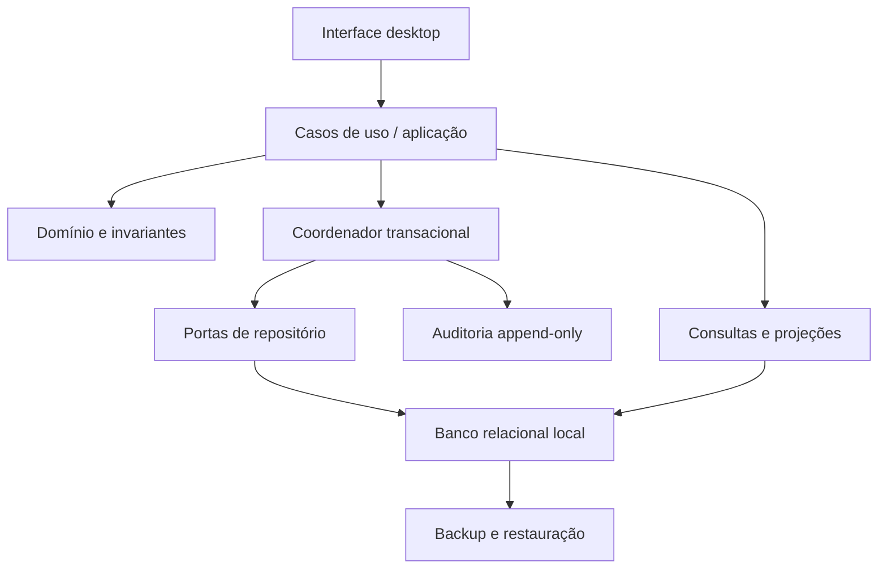

# SPRINT-CODEX-068 — Arquitetura, Domínio e Modelo Lógico

## 1. Decisão arquitetural

Aplicação desktop offline-first, de processo único, com banco relacional local transacional. Arquitetura em camadas e módulos, sem dependência de rede para a operação diária.

### Camadas

- **Interface:** entrada, validação de formato, mensagens e navegação; não decide regras.
- **Aplicação:** orquestra casos de uso, autorização, idempotência e transações.
- **Domínio:** estados, invariantes, fórmulas e políticas puras.
- **Persistência:** repositórios, unidade de trabalho, restrições e consultas.
- **Infraestrutura:** banco, relógio, geração de identificadores, hash, backup e arquivos.
- **Observabilidade:** auditoria, pendências e diagnóstico local.

Dependências apontam para o domínio. Persistência não é acessada diretamente pela interface. Comandos alteram estado; consultas leem projeções sem efeitos.

## 2. Componentes e limites

| Componente | Responsabilidade | Não pode |
|---|---|---|
| Identidade e sessão | operador, autenticação, timeout, reidentificação | editar registros de negócio |
| Cadastros | clientes, produtos, insumos, fornecedores, categorias | reescrever fotografias históricas |
| Compras | recebimento, conversão, custo médio | alterar estoque fora de transação |
| Estoque | movimentos, saldos, reservas, inventário | aceitar saldo negativo |
| Produção | OP, reserva/consumo, rendimento, perdas | concluir parcialmente efeitos atômicos |
| Pedidos | pedido, itens, preço, desconto, reserva | reconhecer venda antes do atendimento |
| Entrega/retirada | atendimento e reconhecimento da venda | duplicar baixa de estoque |
| Financeiro | pagamentos, estornos, despesas, caixa | confundir recebimento e venda |
| Reserva financeira | movimentos e saldo reservado | classificar reserva como despesa |
| Fechamento/relatórios | fotografias e reconciliação | apagar ajustes posteriores |
| Pendências | inconsistências e resolução | alterar origem silenciosamente |
| Auditoria | eventos imutáveis | editar ou excluir eventos |
| Backup | cópia consistente e restauração | declarar sucesso sem validação |

## 3. Princípios de persistência

- Identificadores globais opacos e imutáveis.
- Datas em UTC para registro; data local explícita para competência operacional.
- Dinheiro em inteiro na menor unidade monetária; nunca ponto flutuante.
- Quantidades em decimal de precisão fixa por unidade de controle.
- Linhas históricas são append-only ou recebem apenas campos de inativação permitidos.
- Toda correção referencia a operação original.
- Chaves estrangeiras ativas; exclusão física proibida para registros usados.
- Restrições de unicidade sustentam idempotência.
- Escritas críticas usam transação serializada e verificação otimista de versão.

## 4. Agregados

| Agregado | Raiz | Conteúdo / fronteira transacional |
|---|---|---|
| Identidade | Operador | credencial, sessão e eventos de acesso |
| Catálogo | Produto/Insumo | categoria, tamanho, unidade e inativação |
| Receita | Versão de Receita | componentes imutáveis após publicação/uso |
| Compra | Compra | itens, conversões e recebimento |
| Estoque | Item controlado | movimentos, reservas e saldo derivado |
| Pedido | Pedido | itens, preços, descontos, estado comercial |
| Produção | Ordem de Produção | receita capturada, consumos, perdas, rendimento |
| Atendimento | Entrega/Retirada | tentativa, endereço, taxa/custo e confirmação |
| Recebimento | Pagamento | formas, valor, estornos vinculados |
| Financeiro | Lançamento | caixa, despesa e reserva com origem |
| Fechamento | Fechamento | fotografia e ajustes posteriores |
| Integridade | Pendência | origem, severidade, estado e resolução |
| Auditoria | Evento | evidência imutável da tentativa e resultado |

## 5. Catálogo de entidades

| Entidade | Identidade e responsabilidade | Estado/imutabilidade essencial |
|---|---|---|
| Operador | `operador_id`; responsável individual | inativável; identidade histórica preservada |
| Cliente | `cliente_id`; contato e endereços | inativável; fotografias no pedido |
| Consumidor Avulso | identificador de sistema | somente pronta-entrega; não editável como cliente comum |
| Produto | `produto_id`; item vendável | unidade imutável após movimento; inativável |
| Categoria | `categoria_id`; classificação | nome fotografado quando necessário |
| Tamanho | `tamanho_id`; variação de produto | inativável |
| Insumo | `insumo_id`; item controlado | subtipo ingrediente ou embalagem |
| Receita | `receita_id`; conjunto de versões | alteração cria nova versão |
| Versão de Receita | `versao_receita_id`; composição | imutável após uso |
| Fornecedor | `fornecedor_id`; origem de compra | inativável; nome fotografado na compra |
| Compra / Item | IDs próprios; recebimento | confirmada é imutável; correção compensatória |
| Movimento de Estoque | `movimento_id`; razão de alteração | append-only, origem e idempotency key únicas |
| Inventário | `inventario_id`; contagem e ajustes | concluído é imutável |
| Pedido / Item | IDs próprios; compromisso comercial | snapshots de produto, preço e desconto |
| Reserva de Produto | `reserva_id`; separação de saldo | ativa, consumida ou liberada |
| Ordem de Produção | `op_id`; ciclo produtivo | captura versão da receita |
| Consumo de Produção | `consumo_id`; quantidade real | registrado na conclusão integral |
| Perda | `perda_id`; descarte justificado | append-only e efeito classificado |
| Entrega / Retirada | IDs próprios; atendimento | confirmação única; tentativas preservadas |
| Pagamento | `pagamento_id`; recebimento | confirmado e compensado por estorno |
| Estorno | `estorno_id`; reversão vinculada | imutável; soma não excede pagamento |
| Despesa | `despesa_id`; competência e pagamento | ocorrência separada de saída de caixa |
| Movimento de Caixa | `mov_caixa_id`; efeito financeiro | append-only, origem única |
| Movimento da Reserva | `mov_reserva_id`; separação/reversão | append-only, não é despesa |
| Fechamento | `fechamento_id`; fotografia do período | imutável; não bloqueia lançamentos posteriores |
| Ajuste Posterior | `ajuste_id`; correção após fechamento | vincula período e origem |
| Pendência/Inconsistência | IDs próprios; tratamento | auditável e reabrível |
| Evento de Auditoria | `evento_id`; evidência | append-only e encadeável |

## 6. Modelo lógico

Tabelas documentais propostas, sem migration executável:

- `operators`, `operator_credentials`, `sessions`;
- `customers`, `customer_addresses`, `categories`, `sizes`, `products`, `supplies`, `suppliers`;
- `recipes`, `recipe_versions`, `recipe_version_items`;
- `purchases`, `purchase_items`;
- `stock_movements`, `stock_reservations`, `inventories`, `inventory_counts`;
- `orders`, `order_items`, `order_product_reservations`, `order_status_history`;
- `production_orders`, `production_planned_items`, `production_consumptions`, `production_outputs`, `losses`;
- `deliveries`, `delivery_attempts`, `pickups`;
- `payments`, `payment_allocations`, `refunds`, `payment_methods_snapshot`;
- `expenses`, `cash_movements`, `financial_reserve_movements`;
- `closings`, `closing_lines`, `subsequent_adjustments`;
- `pending_items`, `pending_item_history`, `audit_events`, `idempotency_records`;
- `backup_catalog`, `schema_versions`.

### Relações centrais

- Receita 1:N versões; versão 1:N componentes.
- Pedido 1:N itens; item 1:N reservas; pedido 1:N pagamentos e atendimentos.
- OP N:1 versão de receita; OP 1:N consumos, perdas e saídas.
- Toda movimentação N:1 origem polimórfica controlada por `origin_type + origin_id`, validada pela aplicação e por tabela de vínculos quando necessário.
- Pagamento 1:N estornos; fechamento 1:N linhas; ajuste N:1 fechamento.

### Restrições essenciais

- `amount_minor >= 0`; quantidades de comandos positivas.
- soma de estornos ≤ valor confirmado.
- uma confirmação de entrega/retirada por pedido.
- uma conclusão final por OP.
- uma aplicação de efeito por `(operation_type, idempotency_key)`.
- versão de receita usada não aceita alteração.
- referências históricas usam `RESTRICT`; inativação usa timestamp e operador.
- versões de linha (`row_version`) impedem escrita concorrente obsoleta.

## 7. Fotografias e referências vivas

**Fotografias:** nome/telefone/endereço do cliente no pedido; descrição/SKU do produto; preço; desconto; taxa e custo de entrega; fornecedor e conversão na compra; versão e componentes da receita; custos históricos; forma de pagamento; operador exibível; justificativa; categoria; estados e datas.

**Referências vivas:** vínculo ao cadastro para navegação, estado atual de pendência, sessão ativa e preferências de interface.

**Imutáveis:** movimentos, eventos de auditoria, versões usadas, itens de operação concluída, fechamentos e correções. Correções criam estorno, reversão, ajuste, nova versão ou evento corretivo, nunca reescrita retroativa.

## 8. Evolução

Portas de repositório e serviços de aplicação permitem substituir a interface ou persistência no futuro. Multiusuário, web, sincronização e integrações exigirão novas decisões sobre concorrência, identidade e conflito; não integram esta arquitetura executável do MVP.