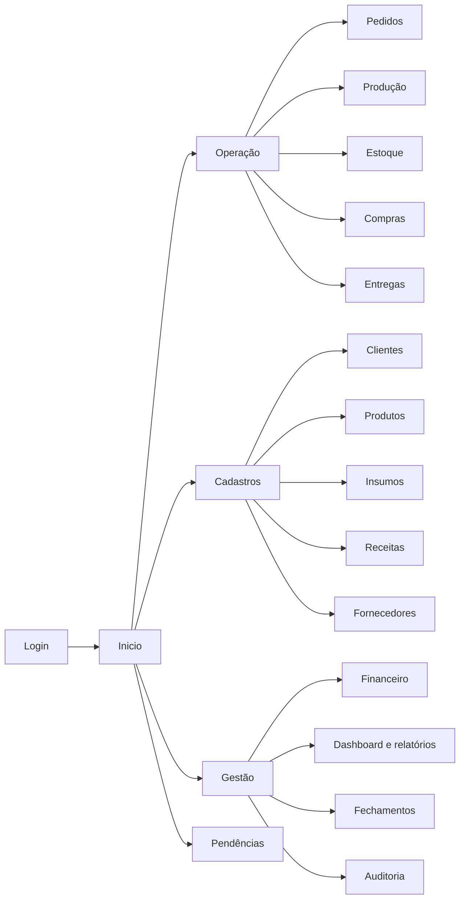

# SPRINT-CODEX-069 — Arquitetura de UX, Navegação e Identidade

## 1. Princípios institucionais

A experiência da OPIE MVP deve transmitir calma, organização, clareza e baixa carga cognitiva. A interface prioriza a tarefa atual, sequência previsível, linguagem não técnica e poucos cliques. Consistência tem precedência sobre variedade visual.

Regras permanentes:

- mostrar localização, objetivo e próximo passo;
- revelar detalhe progressivamente;
- uma ação primária evidente por contexto;
- não depender apenas de cor;
- preservar filtros e contexto ao retornar;
- confirmar ações críticas com impacto e solução;
- oferecer teclado e foco visível;
- evitar módulos, abas e informações simultâneas sem necessidade.

## 2. Identidade OPIE

Nome oficial: **OPIE MVP**.

A referência visual oficial está em `docs/architecture/assets/opie-identidade-institucional-referencia.png`. Devem ser preservados exatamente a tipografia desenhada do nome OPIE, suas proporções, composição e combinação institucional de letras em preto/azul.

A imagem de referência não é mockup obrigatório. Elementos decorativos, disposição da tela de boas-vindas, textos promocionais, ilustrações e módulos nela apresentados são apenas inspiração. Nenhum ativo deve ser redesenhado por aproximação; futura implementação precisa usar arquivo de marca homologado e preservar área de respiro, proporção e contraste.

### Aplicação da marca

- assinatura principal no início e identificação institucional;
- versão compacta somente se homologada;
- não distorcer, rotacionar, recolorir ou recompor letras;
- fundo deve garantir legibilidade;
- texto “MVP” acompanha o nome do produto sem alterar o desenho do logotipo OPIE;
- azul de ação da interface deve ser amostrado do ativo oficial na futura etapa visual, sem inferir nesta Sprint um valor hexadecimal não fornecido.

## 3. Estrutura de navegação

Navegação primária contém no máximo: Início, Operação, Cadastros, Gestão e Pendências. Submódulos aparecem no contexto, não como menu permanente excessivo. Busca global é acesso auxiliar. Configuração e sessão ficam em menu do operador.

## 4. Shell da aplicação

- **Barra superior:** marca, título/contexto, busca, indicador de pendências, operador/sessão.
- **Navegação lateral recolhível:** grupos primários, rótulo e ícone; não somente ícone.
- **Área de conteúdo:** breadcrumb curto, título, descrição operacional, ação primária e conteúdo.
- **Painel contextual:** resumo, próximos passos ou detalhes sem abandonar tarefa.
- **Região de mensagens:** feedback acessível e persistência adequada à gravidade.

Em computador/notebook, largura mínima suportada será decidida pelos parâmetros de plataforma; conteúdo deve evitar rolagem horizontal em fluxos comuns.

## 5. Padrões de fluxo

### Lista → detalhe → ação

Listas têm busca, filtros, ordenação, estado vazio, paginação/virtualização futura e ação primária. Seleção abre detalhe com histórico e ações permitidas pelo estado.

### Assistente operacional

Compras, pedido, OP, fechamento, backup e restauração usam passos: contexto → dados → revisão → confirmação → resultado. Retorno preserva dados enquanto não houver confirmação terminal.

### Ação crítica

1. botão descreve verbo e objeto;
2. resumo mostra efeitos em estoque/financeiro/histórico;
3. justificativa quando exigida;
4. nova identificação quando excepcional;
5. confirmação explícita;
6. resultado único com referência e próximos passos.

### Correção

Tela nunca oferece edição direta de operação concluída. Apresenta “Registrar correção”, explica o evento compensatório e mantém vínculo ao original.

## 6. Estados universais de tela

- carregando localmente;
- pronta;
- vazia com orientação;
- somente leitura;
- edição com alterações não salvas;
- validação inválida;
- ação em processamento, sem duplo clique;
- sucesso com referência;
- bloqueada por regra, com motivo e solução;
- falha recuperável, com repetição segura;
- falha de integridade, com pendência e bloqueio.

## 7. Permissões e sessão

Há um Operador Principal individual. Elementos financeiros exigem sessão válida. Bloqueio por 30 minutos oculta conteúdo e retorna à identificação sem perder transação já confirmada. Ação excepcional apresenta reidentificação no ponto da ação. Não há múltiplos perfis no MVP.

## 8. Linguagem e mensagens

Estrutura: **o que aconteceu → por quê → o que fazer**.

- Sucesso: “Pagamento registrado. Saldo restante: …”.
- Bloqueio: “A produção não pode começar porque falta … Confira o estoque ou ajuste o planejamento.”
- Falha recuperável: “A confirmação não foi concluída. Nenhuma alteração foi aplicada. Tente novamente.”
- Resultado recuperado: “Esta operação já foi concluída. Exibimos o registro existente.”
- Crítico: “Há divergência de integridade. A operação foi bloqueada e uma pendência foi criada.”

Evitar códigos técnicos no texto principal; referência técnica pode aparecer em “Detalhes”.

## 9. Acessibilidade e consistência

- contraste e tamanho legíveis;
- foco visível e ordem lógica;
- rótulo associado a todo campo;
- erro textual junto ao campo e resumo no topo;
- ícones acompanhados de texto ou nome acessível;
- estado não indicado só por cor;
- alvos confortáveis e atalhos sem conflito;
- tabelas com cabeçalhos e leitura coerente.

## 10. Critérios de aceite UX

- usuário identifica módulo e próxima ação sem treinamento extenso;
- fluxo principal não exige navegação entre módulos desnecessários;
- ações terminais impedem repetição visual e técnica;
- filtros/contexto são preservados;
- mensagens descrevem causa e solução;
- marca corresponde ao ativo institucional;
- nenhuma tela cria regra funcional nova.