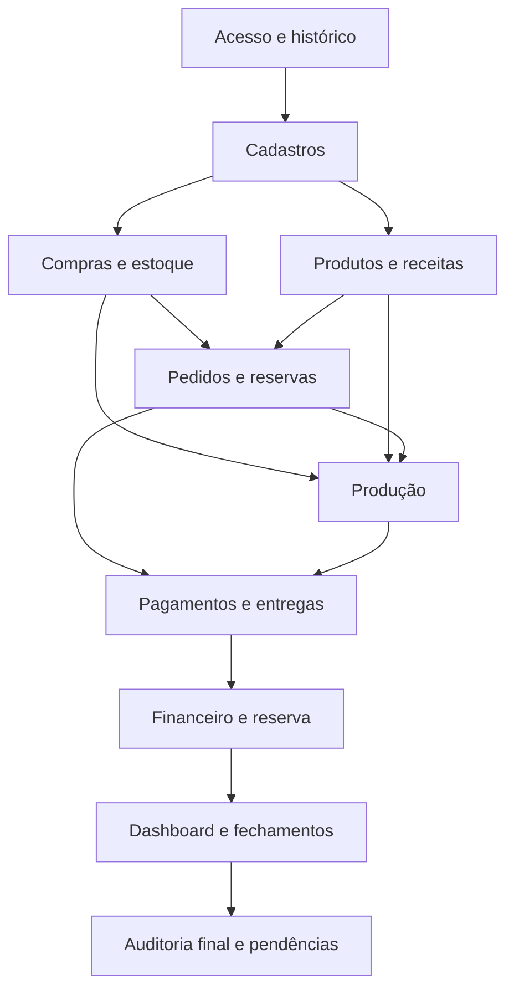

# Parecer Final do Work — Sprint 1, Bloco 10

## Classificação

**Especificação funcional do MVP consolidada e aprovável.**

Não foram identificados conflitos bloqueantes entre os Blocos 1 a 9. Existe uma dependência não funcional obrigatória para a futura Sprint do Codex: definir e validar backup e restauração dos dados.

---

# 1. Escopo oficial do MVP

| Módulo                 | Incluído no MVP                                                                                  | Limitação ou exclusão                             |
| ---------------------- | ------------------------------------------------------------------------------------------------ | ------------------------------------------------- |
| Acesso e segurança     | Operador Principal individual, bloqueio por inatividade e ações críticas                         | Múltiplos perfis adiados                          |
| Cadastros              | Clientes, produtos, categorias, insumos, receitas, fornecedores, tamanhos, pagamentos e despesas | Sem cadastro fiscal ou fidelidade                 |
| Compras                | Recebimento, conversão, fornecedor, custo médio e histórico                                      | Sem pedido formal de compra                       |
| Estoque                | Físico, reservado, disponível, perdas, ajustes e inventário                                      | Sem estoque negativo ou validade automática       |
| Pedidos e vendas       | Pronta-entrega, encomenda, pedido misto, preços, descontos e reservas                            | Sem atendimento parcial                           |
| Produção               | OP, planejamento, consumo, rendimento, perdas e custos                                           | Sem detalhamento das etapas culinárias            |
| Entregas e retiradas   | Agenda, taxa, custo, confirmação e tentativa frustrada                                           | Sem cálculo automático de frete                   |
| Financeiro             | Pagamentos, estornos, despesas, caixa, saldo e inadimplência                                     | Sem contabilidade ou cobrança completa            |
| Reserva financeira     | Manual ou automática, saldo e histórico                                                          | Automática somente sobre recebimentos confirmados |
| Dashboard e relatórios | Vendas, recebimentos, resultado, estoque, produção e clientes                                    | Sem previsões ou metas                            |
| Histórico e auditoria  | Eventos, justificativas, correções e Central de Pendências                                       | Sem análise estatística de comportamento          |
| Navegação e UX         | Menu, busca, filtros, mensagens, atalhos e histórico visual                                      | Celular completo adiado                           |

---

# 2. Fluxo completo do negócio

1. O Operador Principal acessa o sistema.
2. Configura os dados básicos do negócio.
3. Cadastra clientes, produtos, insumos, receitas e fornecedores.
4. Registra compras recebidas.
5. O estoque de insumos e o custo médio são atualizados.
6. Registra um pedido de pronta-entrega ou encomenda.
7. Produtos existentes são reservados.
8. Quantidades faltantes deixam o pedido em **Aguardando Produção**.
9. O operador cria uma OP.
10. Ao iniciar a OP, os insumos são reservados.
11. Ao concluir, os insumos são consumidos e os produtos entram no estoque.
12. Produtos vinculados ao pedido ficam reservados.
13. Pagamentos podem ocorrer antes ou depois do atendimento.
14. O pedido é entregue ou retirado.
15. O estoque dos produtos é baixado.
16. A venda é reconhecida.
17. Caixa, saldo a receber, resultado e reserva são atualizados.
18. Fechamentos e relatórios apresentam as operações.
19. Correções posteriores geram eventos vinculados.
20. A Central de Pendências reúne inconsistências e ações necessárias.

Todas as etapas estão funcionalmente definidas.

---

# 3. Critérios de aceite por módulo

## Acesso e segurança

O módulo será aceito quando:

* exigir identificação do Operador Principal;
* bloquear a sessão após 30 minutos de inatividade;
* impedir contas compartilhadas;
* registrar ações críticas;
* exigir nova identificação em ações excepcionais.

## Cadastros

Será aceito quando:

* permitir criar, consultar, alterar e inativar registros;
* impedir exclusão definitiva;
* alertar possíveis duplicidades;
* manter cadastros inativos nos históricos;
* criar nova versão quando uma receita for alterada;
* impedir alteração da unidade de controle após movimentação.

## Compras

Será aceito quando:

* uma compra em elaboração não alterar estoque;
* a confirmação do recebimento gerar entrada;
* converter corretamente unidades de compra;
* recalcular o custo médio;
* preservar fornecedor, quantidade, preço e conversão;
* corrigir compras recebidas somente por reversão, devolução ou ajuste.

## Estoque

Será aceito quando:

* separar saldo físico, reservado e disponível;
* impedir estoque negativo;
* registrar entradas e saídas vinculadas;
* exigir motivo em ajustes e perdas;
* realizar inventário simplificado;
* preservar saldo anterior e posterior;
* impedir dupla utilização da mesma quantidade.

## Pedidos e vendas

Será aceito quando:

* permitir venda rápida, encomenda e pedido misto;
* aceitar Consumidor Avulso somente em pronta-entrega;
* exigir cliente em encomenda e entrega;
* preservar preços, descontos e endereço;
* reservar produtos existentes;
* indicar quantidades que precisam ser produzidas;
* não reconhecer venda antes da entrega ou retirada;
* impedir atendimento parcial no mesmo pedido.

## Produção

Será aceita quando:

* toda produção possuir OP;
* capturar a versão da receita utilizada;
* reservar insumos no início;
* bloquear início sem estoque suficiente;
* permitir consumo e rendimento reais;
* registrar perdas e substituições;
* concluir todas as movimentações conjuntamente;
* preservar custos históricos;
* encerrar produção parcial e gerar nova OP para o restante.

## Entrega e retirada

Será aceita quando:

* exigir pedido Pronto;
* mostrar eventual saldo pendente;
* confirmar endereço antes da saída;
* separar taxa cobrada e custo real;
* baixar estoque somente na entrega ou retirada;
* registrar tentativas frustradas;
* preservar comprovante e histórico.

## Pagamentos e financeiro

Será aceito quando:

* permitir pagamentos integrais, parciais e antecipados;
* aceitar múltiplas formas;
* calcular o saldo;
* impedir pagamento superior ao saldo, salvo dinheiro com troco;
* separar status comercial e financeiro;
* tratar estornos como novas movimentações;
* preservar despesas pendentes e pagas;
* separar resultado e caixa.

## Reserva financeira

Será aceita quando:

* permitir movimentos manuais e automáticos;
* calcular a reserva automática sobre recebimentos confirmados;
* reverter a parcela correspondente em estornos;
* não tratar reserva como despesa;
* separar caixa total, caixa disponível e saldo reservado.

## Dashboard e relatórios

Será aceito quando:

* reconhecer vendas na entrega ou retirada;
* separar vendas, recebimentos, caixa e resultado;
* identificar resultados provisórios;
* detalhar os registros que formam cada total;
* preservar filtros;
* mostrar correções posteriores;
* produzir fechamento diário sem bloquear o dia.

## Histórico e auditoria

Será aceito quando:

* operações concluídas não puderem ser editadas diretamente;
* correções gerarem eventos vinculados;
* registrar operador, data, ação, motivo e valores;
* exigir justificativa em operações críticas;
* reunir inconsistências na Central de Pendências;
* manter fotografias históricas dos dados.

## Experiência do usuário

Será aceita quando:

* utilizar linguagem não técnica;
* oferecer ações principais em poucos passos;
* apresentar mensagens com motivo e solução;
* não depender somente de cores;
* preservar filtros ao retornar;
* funcionar integralmente em computador e notebook;
* oferecer busca global.

---

# 4. Regras obrigatórias consolidadas

## Vendas

* Venda somente é reconhecida na entrega ou retirada.
* Pagamento não significa venda concluída.
* Cliente é obrigatório em encomenda e entrega.
* Atendimento parcial não integra o MVP.
* Desconto geral poderá ser percentual ou valor, nunca ambos.
* Preço negociado e desconto exigem justificativa.
* Pedido concluído não aceita edição direta.
* Produtos devolvidos não retornam ao estoque vendável.
* Cancelamentos e devoluções permanecem no histórico.

## Produção

* Toda produção exige OP.
* Cada OP utiliza um produto e uma versão de receita.
* Insumos são reservados no início.
* Consumo definitivo ocorre na conclusão.
* Estoque insuficiente bloqueia o início.
* Consumo, rendimento e perdas reais devem ser registrados.
* Produção concluída entra no estoque de produtos prontos.
* Produção parcial termina e gera nova OP para o restante.
* OP concluída não pode ser cancelada diretamente.

## Estoque

* Saldo disponível = físico − reservado.
* Estoque negativo é proibido.
* Saldos não são alterados diretamente.
* Toda movimentação possui origem.
* Ajustes e perdas exigem justificativa.
* Unidade de controle usada não pode ser alterada.
* Inventário gera movimentos de ajuste.
* Ajustes retroativos de estoque são proibidos.
* Devoluções e cancelamentos nunca apagam movimentações.

## Financeiro

* Pagamentos movimentam caixa quando confirmados.
* Recebimentos antecipados não compõem vendas.
* Estornos não apagam pagamentos.
* Despesa ocorrida afeta o resultado.
* Despesa paga afeta o caixa.
* Taxa de entrega cobrada e custo da entrega são separados.
* Custo pendente deixa o resultado provisório.
* Dívida baixada como perda exige confirmação excepcional.

## Resultado

> Resultado da venda = vendas líquidas − custo direto histórico + taxa de entrega − custo real da entrega.

> Resultado do período = resultados das vendas − despesas gerais − custos indiretos − perdas aplicáveis ± ajustes.

Uma perda ou custo não poderá ser descontado duas vezes.

## Reserva

* Reserva não é despesa.
* Entrada na reserva não reduz resultado.
* Saída da reserva não cria receita.
* Reserva automática utiliza recebimentos confirmados.
* Caixa disponível = caixa total − reserva.
* Toda movimentação da reserva possui origem.

## Segurança

* Operador Principal individual.
* Conta compartilhada proibida.
* Ações críticas exigem resumo, justificativa e confirmação.
* Ações excepcionais exigem nova identificação.
* Informações financeiras ficam restritas.
* Nenhum registro utilizado pode ser excluído.

## Histórico e auditoria

* Operações concluídas são imutáveis.
* Correções ocorrem por estorno, ajuste, reversão, nova versão ou evento corretivo.
* Dados históricos permanecem como eram na operação.
* Fechamentos preservam a fotografia original.
* Ajustes posteriores permanecem vinculados.
* Tentativas críticas bloqueadas são auditadas.

---

# 5. Regras importantes

Aumentam a qualidade, mas não impedem o primeiro fluxo operacional:

* busca global;
* produtos recentes;
* duplicação de pedido como rascunho;
* impressão simples;
* gráficos gerenciais;
* fechamento mensal;
* valor estimado do estoque;
* agrupamento manual de pedidos em uma OP;
* alertas de estoque mínimo;
* consultas ampliadas de perdas e rendimento;
* otimização para tablet.

---

# 6. Funcionalidades adiadas

| Funcionalidade                         | Motivo                                       |
| -------------------------------------- | -------------------------------------------- |
| Orçamento formal                       | Pedido em elaboração atende ao MVP           |
| Atendimento parcial                    | Complexidade de estoque, pagamento e entrega |
| Crédito para compra futura             | Exige controle financeiro adicional          |
| Documentos fiscais                     | Fora do escopo inicial                       |
| Cálculo automático da entrega          | Taxa manual foi aprovada                     |
| Estoque de formas reutilizáveis        | Baixo valor inicial                          |
| Lotes e validade automática de insumos | Complexidade desproporcional                 |
| Múltiplos usuários                     | MVP possui um operador                       |
| Acesso de entregadores                 | Exige novos perfis                           |
| Celular completo                       | Prioridade é computador e notebook           |
| Metas e previsões                      | Dependem de histórico confiável              |
| Giro e cobertura de estoque            | Análise gerencial futura                     |
| Produtividade por tempo                | Não haverá controle detalhado de tarefas     |
| Sugestão automática de produção        | Decisão permanece humana                     |
| Avaliação de fornecedores              | Fora da necessidade operacional inicial      |
| Fidelidade e promoções                 | Não essenciais ao núcleo                     |
| Exportação tabular                     | Importante após consolidação                 |
| Integração com OPIE e APIs             | Evolução futura                              |
| Várias operações simultâneas           | MVP atende uma única operação                |
| Aplicação web e acesso remoto          | Evolução técnica futura                      |

---

# 7. Backlog priorizado

## Essencial

| Item                             | Objetivo                            | Dependências                  |
| -------------------------------- | ----------------------------------- | ----------------------------- |
| Acesso do Operador Principal     | Identificar o responsável           | Nenhuma                       |
| Histórico e correções vinculadas | Preservar rastreabilidade           | Acesso                        |
| Cadastros básicos                | Disponibilizar entidades do negócio | Acesso                        |
| Produtos e receitas versionadas  | Permitir custos e produção          | Insumos e produtos            |
| Compras e conversões             | Alimentar estoque                   | Insumos e fornecedores        |
| Estoque e movimentações          | Controlar saldos                    | Cadastros e compras           |
| Pedidos e reservas               | Registrar compromissos              | Clientes, produtos e estoque  |
| OP e produção                    | Gerar produtos acabados             | Receitas, estoque e pedidos   |
| Pagamentos e estornos            | Controlar valores                   | Pedidos                       |
| Entrega e retirada               | Concluir vendas                     | Pedidos, estoque e pagamentos |
| Despesas e caixa                 | Controlar resultado financeiro      | Categorias financeiras        |
| Reserva financeira               | Separar recursos                    | Pagamentos                    |
| Central de Pendências            | Expor inconsistências               | Todos os módulos              |

## Alta

| Item                        | Objetivo                  | Dependências                |
| --------------------------- | ------------------------- | --------------------------- |
| Página inicial operacional  | Orientar a rotina         | Pedidos, produção e estoque |
| Dashboard gerencial         | Apoiar decisões           | Vendas, custos e financeiro |
| Fechamento diário           | Criar fotografia do dia   | Operações financeiras       |
| Inventário físico           | Validar estoque           | Movimentações               |
| Inadimplência               | Controlar saldos vencidos | Pedidos e pagamentos        |
| Auditoria de ações críticas | Revisar riscos            | Histórico                   |

## Média

* busca global;
* gráficos;
* fechamento mensal;
* impressão e PDF;
* produtos mais utilizados;
* agrupamento de pedidos;
* consultas gerenciais ampliadas;
* experiência otimizada para tablet.

## Futuro

Todas as funcionalidades relacionadas na seção de adiamentos.

---

# 8. Dependências e ordem lógica

Essa ordem representa dependência funcional, não uma decisão técnica de implementação.

---

# 9. Casos críticos obrigatórios

* pagamento antecipado antes da entrega;
* pedido sem estoque;
* pedido misto;
* produção com insumo insuficiente;
* consumo diferente da receita;
* rendimento menor;
* produção parcial;
* perda total do lote;
* cancelamento depois do início da produção;
* cancelamento com pagamento;
* entrega com saldo pendente;
* tentativa frustrada de entrega;
* devolução do cliente;
* estorno parcial;
* compra com conversão;
* ajuste de inventário;
* tentativa de estoque negativo;
* correção após fechamento;
* reserva automática seguida de estorno;
* operação emergencial lançada posteriormente;
* tentativa de confirmação duplicada;
* alteração de receita após produções anteriores.

---

# 10. Casos de teste funcionais

| Situação inicial      | Ação                               | Resultado esperado                               |
| --------------------- | ---------------------------------- | ------------------------------------------------ |
| Produto disponível    | Registrar venda rápida             | Reserva, pagamento e retirada concluídos         |
| Pedido sem produto    | Confirmar encomenda                | Status Aguardando Produção                       |
| Pedido misto          | Confirmar                          | Reservar disponível e indicar falta              |
| Estoque insuficiente  | Iniciar OP                         | Operação bloqueada e faltas apresentadas         |
| OP válida             | Concluir produção                  | Consumir insumos e adicionar produtos            |
| Rendimento menor      | Informar quantidade real           | Custo unitário recalculado                       |
| Parte produzida       | Encerrar parcialmente              | Produtos entram e nova demanda permanece         |
| Pagamento antecipado  | Confirmar pagamento                | Caixa aumenta, venda não é reconhecida           |
| Pedido pago           | Cancelar antes da entrega          | Estorno, liberação de reservas e histórico       |
| Produto pronto        | Cancelar pedido                    | Produto fica disponível ou vira perda            |
| Pedido com saldo      | Confirmar entrega                  | Exigir confirmação e vencimento                  |
| Entrega frustrada     | Registrar ocorrência               | Produto continua vinculado e pedido é reagendado |
| Produto devolvido     | Registrar devolução                | Produto vira perda e não retorna à venda         |
| Compra em kg          | Confirmar recebimento              | Quantidade convertida para gramas                |
| Inventário divergente | Confirmar ajuste                   | Novo saldo com justificativa                     |
| Estoque zerado        | Tentar baixa                       | Operação bloqueada                               |
| Pagamento confirmado  | Estornar parcialmente              | Caixa, saldo e reserva são corrigidos            |
| Receita utilizada     | Criar nova versão                  | Histórico anterior permanece                     |
| Dia fechado           | Registrar correção                 | Ajuste posterior vinculado                       |
| Pedido já entregue    | Confirmar novamente                | Duplicidade bloqueada                            |
| Sistema indisponível  | Lançar registro emergencial depois | Origem e duas datas preservadas                  |
| Despesa paga          | Tentar editar                      | Edição bloqueada; oferecer reversão              |

---

# 11. Critérios de conclusão do MVP

O MVP estará pronto para uso quando:

* todos os fluxos essenciais funcionarem de ponta a ponta;
* estoque negativo for impossível;
* operações relacionadas forem concluídas integralmente;
* histórico sobreviver a alterações cadastrais;
* cancelamentos, estornos e perdas forem rastreáveis;
* vendas, recebimentos, caixa, resultado e reserva estiverem separados;
* saldos e indicadores puderem ser reconciliados;
* nenhuma inconsistência crítica permanecer aberta;
* ações críticas exigirem os controles definidos;
* os casos críticos forem validados;
* houver procedimento de backup e restauração comprovadamente funcional;
* uma operação real simulada puder ser executada do cadastro ao fechamento.

## Cenário final obrigatório

1. cadastrar insumos e produto;
2. registrar compra;
3. criar pedido com pagamento parcial;
4. produzir;
5. concluir a entrega;
6. receber o saldo;
7. registrar despesa;
8. movimentar reserva;
9. consultar resultado;
10. realizar fechamento;
11. corrigir uma ocorrência sem apagar o histórico.

---

# 12. Preparação para a Sprint Técnica

O Codex deverá receber:

* esta especificação funcional consolidada;
* pareceres aprovados dos Blocos 1 a 10;
* vocabulário oficial;
* estados e transições;
* fórmulas;
* critérios de aceite;
* backlog;
* casos críticos;
* cenários de validação;
* funcionalidades adiadas;
* limitações do MVP;
* regras de segurança e auditoria.

Antes de implementar, o Codex deverá definir tecnicamente:

* mecanismo de backup e restauração;
* funcionamento offline;
* recuperação de acesso;
* armazenamento e proteção dos dados;
* tratamento de falhas durante operações integrais;
* instalação e atualização;
* estratégia de testes;
* organização do repositório;
* migração futura.

Essas são decisões técnicas e não foram tomadas pelo Work.

---

# 13. Riscos remanescentes

| Risco                                           | Nível | Tratamento                           |
| ----------------------------------------------- | ----: | ------------------------------------ |
| Backup e restauração ainda não definidos        |  Alto | Portão obrigatório da Sprint Técnica |
| Dependência de um único operador                | Médio | Perfis futuros                       |
| Lançamentos emergenciais gerarem duplicidade    |  Alto | Conferência obrigatória              |
| Custos indiretos manuais serem imprecisos       | Médio | Evolução futura                      |
| Ausência de validade automática                 | Médio | Controle manual de perdas            |
| Dados pessoais sem política jurídica definitiva | Médio | Validação antes da comercialização   |
| Resultado gerencial ser confundido com contábil |  Alto | Vocabulário e avisos claros          |
| Atendimento parcial indisponível                | Baixo | Dividir em pedidos                   |
| Uso em celular limitado                         | Baixo | Evolução futura                      |
| Reserva depender de recebimentos corretos       | Médio | Vínculo e auditoria                  |

---

# 14. Vocabulário oficial consolidado

| Termo                | Definição                                  |
| -------------------- | ------------------------------------------ |
| Pedido               | Registro comercial desde sua elaboração    |
| Venda                | Pedido entregue ou retirado                |
| Encomenda            | Pedido para atendimento futuro             |
| Consumidor Avulso    | Cliente genérico de pronta-entrega         |
| OP                   | Ordem que registra uma produção            |
| Insumo               | Ingrediente ou embalagem                   |
| Receita              | Composição do produto                      |
| Versão da receita    | Fotografia imutável da composição          |
| Produto pronto       | Produto concluído                          |
| Saldo físico         | Quantidade existente                       |
| Reserva              | Quantidade separada sem saída              |
| Disponível           | Físico menos reservado                     |
| Ajuste               | Correção compensatória                     |
| Perda                | Item sem aproveitamento                    |
| Pagamento            | Valor recebido                             |
| Saldo a receber      | Valor ainda devido                         |
| Estorno              | Devolução vinculada ao pagamento           |
| Taxa de entrega      | Valor cobrado do cliente                   |
| Custo da entrega     | Valor suportado pelo negócio               |
| Vendas brutas        | Produtos antes dos descontos               |
| Vendas líquidas      | Vendas brutas menos descontos              |
| Resultado da venda   | Valor comercial menos custos aplicáveis    |
| Resultado do período | Resultado gerencial após despesas e perdas |
| Caixa total          | Entradas menos saídas financeiras          |
| Caixa disponível     | Caixa total menos reserva                  |
| Reserva financeira   | Valor separado, sem natureza de despesa    |
| Operador Principal   | Responsável máximo pelo MVP                |
| Ação crítica         | Operação com impacto relevante             |
| Justificativa        | Explicação obrigatória                     |
| Histórico            | Linha do tempo de uma operação             |
| Auditoria            | Consulta estruturada dos eventos           |
| Inativação           | Impedimento de novo uso                    |
| Inconsistência       | Situação contrária às regras               |
| Pendência            | Situação que exige ação                    |
| Fechamento           | Fotografia gerencial do período            |
| Ajuste posterior     | Correção registrada depois do fechamento   |

---

# 15. Checklist de consistência

* [x] Cadastro integrado com pedidos e produção.
* [x] Produtos vinculados a receitas versionadas.
* [x] Compra integrada ao estoque e custo médio.
* [x] Estoque separado em físico, reservado e disponível.
* [x] Pedido sem estoque integrado à produção.
* [x] Produção integrada ao produto pronto.
* [x] Entrega integrada à baixa de estoque.
* [x] Pagamento separado do reconhecimento da venda.
* [x] Resultado separado do caixa.
* [x] Reserva separada de despesa.
* [x] Cancelamentos e estornos sem exclusão.
* [x] Relatórios preservam valores históricos.
* [x] Auditoria registra correções.
* [x] Central de Pendências reúne inconsistências.
* [x] Vocabulário sem conflitos relevantes.
* [x] Funcionalidades futuras separadas do MVP.
* [ ] Backup e restauração dependem da Sprint Técnica.

---

# 16. Recomendações finais

O Work recomenda à Sala de Reuniões:

1. aprovar integralmente o escopo funcional consolidado;
2. declarar concluído o Bloco 10;
3. encerrar a Sprint 1 após o registro oficial;
4. congelar funcionalmente o MVP;
5. exigir autorização da Sala para qualquer ampliação;
6. encaminhar ao Codex uma Sprint exclusivamente técnica;
7. incluir backup e restauração como portão técnico obrigatório;
8. exigir planejamento e critérios de teste antes da implementação;
9. manter funcionalidades adiadas fora da primeira versão;
10. validar o MVP por um cenário operacional completo antes de ampliá-lo.

## Parecer final

**O MVP está funcionalmente especificado e apto a seguir para especificação técnica, condicionado à aprovação da Sala de Reuniões.**

O Work encerra sua atuação consultiva neste bloco e não inicia nenhuma Sprint técnica.
